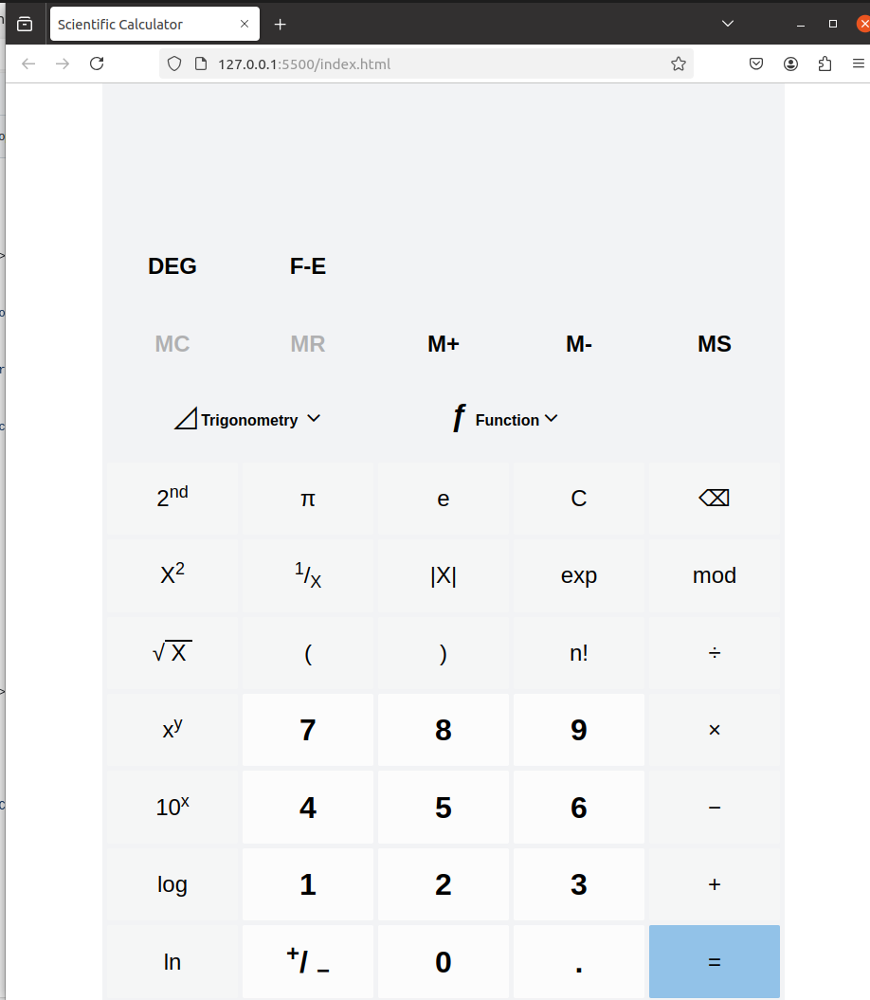

# Scientific Calculator

This is a **Scientific Calculator** built using **HTML**, **CSS**, and **JavaScript**. It features basic arithmetic operations, memory functions, scientific operations like square, reciprocal, and factorial, as well as trigonometric, logarithmic, and exponential operations. The app also supports keyboard inputs and offers a responsive design using the **Bootstrap grid system** for layout.

## Calculator Screenshot

## Features

- **Basic Operations**: Addition, Subtraction, Multiplication, Division
- **Advanced Functions**: Square, Reciprocal, Modulo
- **Memory Functions**: Store, Add, Subtract, Recall, Clear
- **Keyboard Support**: Fully supports keyboard events for quick calculations
- **Responsive Design**: Adaptable to different screen sizes using Bootstrap's grid system
- **Result Display**: Shows calculations and results in real-time

## Supported Operations

### Arithmetic Operations
- **Addition (+):** Add two numbers.
- **Subtraction (-):** Subtract the second number from the first.
- **Multiplication (*):** Multiply two numbers.
- **Division (/):** Divide the first number by the second.
- **Modulo (mod):** Calculate the remainder of division.

### Advanced Operations
- **Square (x²):** Square a given number.
- **Reciprocal (1/x):** Find the reciprocal of a number.

### Memory Operations
- **M+ (Memory Add):** Add the current value to memory.
- **M- (Memory Subtract):** Subtract the current value from memory.
- **MS (Memory Store):** Store the current value in memory.
- **MC (Memory Clear):** Clear the stored memory value (enabled only when memory is non-zero).
- **MR (Memory Recall):** Recall the stored memory value (enabled only when memory is non-zero).

## Example Usage
1. Input the desired operation symbol (e.g., `+`, `-`, etc.).
2. Provide the necessary inputs for the operation.
3. Press calculate to see the result.

## Notes
- **Division by zero** or **wrong expressions** will result in an error during evaluation, and an appropriate error message will be displayed.
- Results for floating-point operations will display up to **two decimal places** for clarity.
- **MC** and **MR** are only enabled when the memory value is not zero.
- Ensure all inputs are valid numbers.

